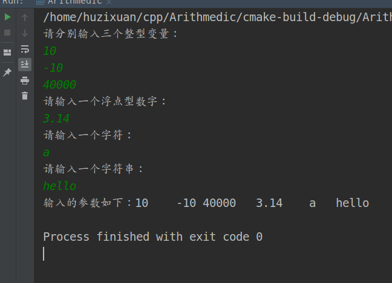

# 						Cpp实践

### 问题01：

```cpp
1、编写一个程序，从键盘接收3个实数（10.0,20.0,5.0）分别输出3个数的和s,乘积t,平均值a
```

```cpp
#include <iostream>
using namespace std;
/* 1.编写一个程序，从键盘接收3个实数（10.0,20.0,5.0）分别输出3个数的和s,乘积t,平均值a*/
int Sum(float num1, float num2, float num3){
    return num1+num2+num3;
}
int pix(float num1, float num2, float num3){
    return num1*num2*num3;
}
int main(){
    cout<<"请输入三个数字："<<endl;
    float reciv1,reciv2,reciv3;
    cin>>reciv1>>reciv2>>reciv3;
    float s=Sum(reciv1,reciv2,reciv3);
    float t=pix(reciv1,reciv2,reciv3);
    float a=s/3;
    cout<<"运算的和为："<<s<<"\n"<<"运算的积为："<<t<<"\n"<<"运算的平均数为："<<a<<endl;
    return 0;
}
```


### 问题02：

```cpp
2、要求用户输入两个整数a,b（分别为20,10），读取从键盘输入的值，然后：
 * 1）、用整数输出这两个数的和、差;
 * 2）、用长整型输出这两个数的乘积，用float输出商;
 * 3）、用整数输出两个数的余数，用float输出商。
```

```cpp
#include <iostream>
using namespace std;
int Sum(int num1,int num2){
    return num1+num2;
}
int Diff(int num1,int num2){
    return num1-num2;
}
long Accu(int num1,int num2){
    return num1*num2;
}
float Merch(int num1,int num2){
    return num1/num2;
}
int Remain(int num1,int num2){
    return num1%num2;
}
float Average(int num1,int num2){
    float result=num1+num2;
    return result/2;
}
int main(){
   cout<<"请输入两个数字：";
   int reciv1,reciv2;
   cin>>reciv1>>reciv2;
   cout<<"和为："<<Sum(reciv1,reciv2)<<"\t"
   <<"差为："<<Diff(reciv1,reciv2)<<"\t"<<"积为："<<Accu(reciv1,reciv2)<<"\t"
   <<"商为："<<Merch(reciv1,reciv2)<<"\t"<<"余为："<<Remain(reciv1,reciv2)<<"\t"
   <<"平均为："<<Average(reciv1,reciv2)<<"\t"<<endl;
    return 0;
}
```


### 问题03：

```cpp
3、从键盘接收一个一位的整型数，经转换，用字符函数putchar输出。
例如输入整数5,程序运行后输出字符5
```

 

```cpp
#include <iostream>
using namespace std;
/*3、从键盘接收一个一位的整型数，经转换，用字符函数putchar输出*/
int Trans(int num){
    return putchar(num);
}

int main(){
    cout<<Trans(66);
    return 0;
}
```


### 问题04：

```cpp
4、输入半径，计算球的表面积
```

```cpp
#include <iostream>
#include <math.h>
#define PI acos(-1)
using namespace std;
/*4、输入半径，计算球的表面积*/
float Acculate(float R){
    return 4*R*R*PI;
}
int main(){
    cout<<Acculate(4);
    return 0;
}

```


### 问题05：

```cpp
5、通过键盘给6个变量赋值，然后将变量的值打印在屏幕上打印输出
这6个值分别为：10 -10 40000 3.14 a hello 
```

```cpp
/*5、通过键盘给6个变量赋值，然后将变量的值打印在屏幕上打印输出
 * 这6个值分别为：10 -10 40000 3.14 a hello */
void Writer(){
    int reciv1,reciv2,reciv3;
    float reciv4;
    char str1;
    string str2;
    cout<<"请分别输入三个整型变量："<<endl;
    cin>>reciv1>>reciv2>>reciv3;
    cout<<"请输入一个浮点型数字："<<endl;
    cin>>reciv4;
    cout<<"请输入一个字符："<<endl;
    cin>>str1;
    cout<<"请输入一个字符串："<<endl;
    cin>>str2;
    cout<<"输入的参数如下："<<reciv1<<"\t"<<reciv2<<"\t"
        <<reciv3<<"\t"<<reciv4<<"\t"<<str1<<"\t"<<str2<<endl;
}
```



### 问题06：

```cpp
6、键盘输入三个整数，分别存放在变量num1 num2 num3中，找出其中最小的数
```

```cpp
/*6、键盘输入三个整数，分别存放在变量num1 num2 num3中，找出其中最小的数*/
int FindMin(int num1,int num2,int num3){
    if(num1<num2&&num2>num3&&num1<num3)
        return num1;
    if(num2<num1&&num1>num3&&num2<num3)
        return num2;
    if(num3<num1&&num1>num3&&num3<num2)
        return num3;
    return 0;
}
```


### 问题07：

```cpp
7、将小写字母改为大写，大写改为小写
```

```cpp
/*7、将小写字母改为大写，大写改为小写*/
void Retu_Char(char para){
   if(para>='a'&&para<='z'){
       para-=32;
   } else if(para>='A'&&para<='Z'){
       para+=32;
   }
   cout<<para;
}
int main(){
    cout<<"请输入一个字母：";
    char c;
    cin>>c;
    Retu_Char(c);
    return 0;
}
```


### 问题08：

```cpp
8、计算下列的分段函数：
 f(x)=x^2+x-6 x<0 && x=\-3
 f(x)=x^2-5x+6 0<=x<10 && x=\2 && x=\3
 f(x)=x^2-x-1 others
```

```cpp
/*8、计算下列的分段函数：
 * f(x)=x^2+x-6 x<0 && x=\-3
 * f(x)=x^2-5x+6 0<=x<10 && x=\2 && x=\3
 * f(x)=x^2-x-1 others*/
int Jud(int x){
    if(x<0 && x!=3){
        return (x*x+x-6);
    } else if(x>=0 && x<10 && x!=2 && x!=3){
        return (x*x-5*x+6);
    } else{
        return (x*x-x-1);
    }
}
int main(){
    cout<<"请输入一个数字："<<endl;
    int x;
    cin>>x;
    cout<<Jud(x);
    return 0;
}
```


### 问题09：

```cpp
9、键盘接收一个字符串(只含大、小写英文字母)，将该字符串加密后输出。
 规则为：小写字母不变，大写的将其转换为小写后再向后移动一位，如：A->b、
 Z->a
```


```cpp
/*9、键盘接收一个字符串(只含大、小写英文字母)，将该字符串加密后输出。
 * 规则为：小写字母不变，大写的将其转换为小写后再向后移动一位，如：A->b、
 * Z->a*/
void Trans_A_Z(string para){
    for(int i=0;i<para.length();i++){
        if(para[i]>='A'&&para[i]<='Z'){
            para[i]+=33;
        }
        cout<<para[i];
    }
}
int main(){
    cout<<"请输入字符串："<<endl;
    string str;
    cin>>str;
    Trans_A_Z(str);
    return 0;
}
```


### 问题10：

```cpp
10、使用键盘输入任意两个变量,若a大于b,则直接输出a,b,否则将a,b的值互换输出
```


```cpp
/*10、使用键盘输入任意两个变量,若a大于b,则直接输出a,b,否则将a,b的值互换输出*/
void swap(int *para1,int *para2){
        int *temp=para1;
        para1=para2;
        para2=temp;
        cout<<*para1<<"\t"<<*para2<<endl;
}
int main(){
    cout<<"请输入两个数字："<<endl;
    int num1,num2;
    cin>>num1>>num2;
    if(num1>num2){
        cout<<num1<<"\t"<<num2<<endl;
    } else{
        swap(&num1,&num2);
    }
    return 0;
}
```


### 问题11：

```cpp
11、由系统随机生成一个10以内的数字，
 用户随机输入一个10以内的数字，若二者相等则返回ok,否则返回ERROR
```

```cpp
/*11、由系统随机生成一个10以内的数字，
 * 用户随机输入一个10以内的数字，若二者相等则返回ok,否则返回ERROR*/
#include<iostream>
#include<time.h>
using namespace std;
void Equal(int para){
    srand(time(NULL));
    int num=rand();
    num=num%10;
    cout<<"随机产生的数字为："<<num<<endl;
    if(para==num) cout<<"OK";
    cout<<"ERROR";
}
int main(){
    cout<<"请输入一个10以内的数字："<<endl;
    int num;
    cin>>num;
    Equal(num);
    return 0;
}
```


###  问题12：

```cpp
12、输入两个数字a、b,若a、b之和大于100,则输出百位上的数字，否则输出两数之和
```

```cpp
/*12、输入两个数字a、b,若a、b之和大于100,则输出百位上的数字，否则输出两数之和*/
int Sum_a(int para1,int para2){
    if((para1+para2)>100){
        int result=(para1+para2)/100;
        return result;
    }

    return (para1+para2);
}
int main(){
    cout<<"请输入两个数字:"<<endl;
    int num1,num2;
    cin>>num1>>num2;
    cout<<Sum_a(num1,num2);
    return 0;
}
```


### 问题13：

```cpp
13、计算函数的值
 f(x)=3x+10 100>x>=0
 f(x)=x^3-20 x>=100
```

```cpp
/*13、计算函数的值
 * f(x)=3x+10 100>x>=0
 * f(x)=x^3-20 x>=100*/
int Function(int x){
    if(x>=0 && x<100) return (3*x+10);
    if(x>=100) return (x*x*x-20);
}
int main(){
    cout<<"请输入一个数字:"<<endl;
    int x;
    cin>>x;
    cout<<Function(x);
    return 0;
}
```


### 问题14：

```cpp
14、编写一个简单的计算器，操作格式为 data op data,op有+、-、*、/
```

```cpp
/*14、编写一个简单的计算器，操作格式为 data op data,op有+、-、*、/ */
int Caculata(int para1,char op,int para2){
    if(op=='+'){
        return (para2+para2);
    }
    if(op=='-'){
        return (para1-para2);
    }
    if(op=='*'){
        return (para1*para2);
    }
    if(op=='/'){
        return (para1/para2);
    }
    return 0;
};
int main(){
    int num1,num2;
    char op;
    cout<<"第一个数字："<<endl; cin>>num1;
    cout<<"操作："<<endl; cin>>op;
    cout<<"第二个数字："<<endl; cin>>num2;
    if(op=='/' && num2==0){
        cout<<"被除数不应为0"<<endl;
    }
    cout<<Caculata(num1,op,num2);
    return 0;
}
```


### 问题15：

```cpp
15、输入一个数字，判断其是否能被3、5、7整除，并输出一下信息：
 1）能被3、5、7整除
 2）能被其中的两个数整除（指出哪两个）
 3）能被其中一个整除（指出哪一个）
 4)不能被3、5、7任一个整除*/
```

```cpp
/*15、输入一个数字，判断其是否能被3、5、7整除，并输出一下信息：
 * 1）能被3、5、7整除
 * 2）能被其中的两个数整除（指出哪两个）
 * 3）能被其中一个整除（指出哪一个）
 * 4)不能被3、5、7任一个整除*/
int Jud_div(int para){
    if(para%3==0 && para%5==0 && para%7==0) cout<<para<<"可以被3、5、7整除"<<endl;
    if(para%3==0 && para%5==0 &&para%7!=0) cout<<para<<"可以被3、5整除"<<endl;
    if(para%3==0 && para%5!=0 &&para%7==0) cout<<para<<"可以被3、7整除"<<endl;
    if(para%3!=0 && para%5==0 &&para%7==0) cout<<para<<"可以被5、7整除"<<endl;
    if(para%3==0 && para%5!=0 &&para%7!=0) cout<<para<<"可以被3整除"<<endl;
    if(para%3!=0 && para%5==0 &&para%7!=0) cout<<para<<"可以被5整除"<<endl;
    if(para%3!=0 && para%5!=0 &&para%7==0) cout<<para<<"可以被7整除"<<endl;
    if(para%3!=0 && para%5!=0 &&para%7!=0) cout<<para<<"不可以被3、5、7整除"<<endl;
    return 0;
}
int main(){
    cout<<"请输入一个数字："<<endl;
    int num;
    cin>>num;
    Jud_div(num);
    return 0;
}
```


### 问题16：

```cpp
16、已知从2008年12月开始，银行整存整取存款不同期限的年利率分别为：三个月1.71%、半年1.98%，一年2.25%
两年2.79%、三年3.33%、五年3.60%;
要求输入存钱的本金和期限，求利息和本金的和
```

```cpp
/*16、已知从2008年12月开始，银行整存整取存款不同期限的年利率分别为：三个月1.71%、半年1.98%，一年2.25%
 * 两年2.79%、三年3.33%、五年3.60%;
 * 要求输入存钱的本金和期限，求利息和本金的和*/
#define three 0.0171
#define six 0.0198
#define thw 0.0225
#define two_y 0.0279
#define three_y 0.0333
float Return_Bank(float money,int mon){
    if(mon==3) return (money+money*three);
    if(mon==6) return (money+money*six);
    if(mon==12) return (money+money*thw);
    if(mon==24) return (money+money*two_y);
    if(mon==36) return (money+money*three_y);
    return 0;
}
int main(){
    float money;
    int mon;
    cout<<"请输入本金"<<endl;
    cin>>money;
    cout<<"请输入存款时间"<<endl;
    cin>>mon;
    cout<<Return_Bank(money,mon);
    return 0;
}
```


### 问题17：

