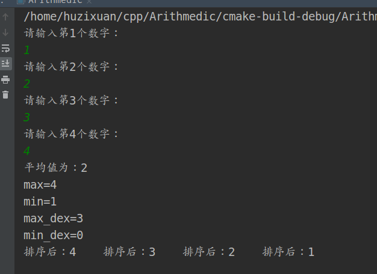

# 						C++上机实践

### 问题01：

```cpp
1、编写一个程序，从键盘接收3个实数（10.0,20.0,5.0）分别输出3个数的和s,乘积t,平均值a
```

```cpp
#include <iostream>
using namespace std;
/* 1.编写一个程序，从键盘接收3个实数（10.0,20.0,5.0）分别输出3个数的和s,乘积t,平均值a*/
int Sum(float num1, float num2, float num3){
    return num1+num2+num3;
}
int pix(float num1, float num2, float num3){
    return num1*num2*num3;
}
int main(){
    cout<<"请输入三个数字："<<endl;
    float reciv1,reciv2,reciv3;
    cin>>reciv1>>reciv2>>reciv3;
    float s=Sum(reciv1,reciv2,reciv3);
    float t=pix(reciv1,reciv2,reciv3);
    float a=s/3;
    cout<<"运算的和为："<<s<<"\n"<<"运算的积为："<<t<<"\n"<<"运算的平均数为："<<a<<endl;
    return 0;
}
```


### 问题02：

```cpp
2、要求用户输入两个整数a,b（分别为20,10），读取从键盘输入的值，然后：
 * 1）、用整数输出这两个数的和、差;
 * 2）、用长整型输出这两个数的乘积，用float输出商;
 * 3）、用整数输出两个数的余数，用float输出商。
```

```cpp
#include <iostream>
using namespace std;
int Sum(int num1,int num2){
    return num1+num2;
}
int Diff(int num1,int num2){
    return num1-num2;
}
long Accu(int num1,int num2){
    return num1*num2;
}
float Merch(int num1,int num2){
    return num1/num2;
}
int Remain(int num1,int num2){
    return num1%num2;
}
float Average(int num1,int num2){
    float result=num1+num2;
    return result/2;
}
int main(){
   cout<<"请输入两个数字：";
   int reciv1,reciv2;
   cin>>reciv1>>reciv2;
   cout<<"和为："<<Sum(reciv1,reciv2)<<"\t"
   <<"差为："<<Diff(reciv1,reciv2)<<"\t"<<"积为："<<Accu(reciv1,reciv2)<<"\t"
   <<"商为："<<Merch(reciv1,reciv2)<<"\t"<<"余为："<<Remain(reciv1,reciv2)<<"\t"
   <<"平均为："<<Average(reciv1,reciv2)<<"\t"<<endl;
    return 0;
}
```


### 问题03：

```cpp
3、从键盘接收一个一位的整型数，经转换，用字符函数putchar输出。
例如输入整数5,程序运行后输出字符5
```

 

```cpp
#include <iostream>
using namespace std;
/*3、从键盘接收一个一位的整型数，经转换，用字符函数putchar输出*/
int Trans(int num){
    return putchar(num);
}

int main(){
    cout<<Trans(66);
    return 0;
}
```


### 问题04：

```cpp
4、输入半径，计算球的表面积
```

```cpp
#include <iostream>
#include <math.h>
#define PI acos(-1)
using namespace std;
/*4、输入半径，计算球的表面积*/
float Acculate(float R){
    return 4*R*R*PI;
}
int main(){
    cout<<Acculate(4);
    return 0;
}

```


### 问题05：

```cpp
5、通过键盘给6个变量赋值，然后将变量的值打印在屏幕上打印输出
这6个值分别为：10 -10 40000 3.14 a hello 
```

```cpp
/*5、通过键盘给6个变量赋值，然后将变量的值打印在屏幕上打印输出
 * 这6个值分别为：10 -10 40000 3.14 a hello */
void Writer(){
    int reciv1,reciv2,reciv3;
    float reciv4;
    char str1;
    string str2;
    cout<<"请分别输入三个整型变量："<<endl;
    cin>>reciv1>>reciv2>>reciv3;
    cout<<"请输入一个浮点型数字："<<endl;
    cin>>reciv4;
    cout<<"请输入一个字符："<<endl;
    cin>>str1;
    cout<<"请输入一个字符串："<<endl;
    cin>>str2;
    cout<<"输入的参数如下："<<reciv1<<"\t"<<reciv2<<"\t"
        <<reciv3<<"\t"<<reciv4<<"\t"<<str1<<"\t"<<str2<<endl;
}
```


### 问题06：

```cpp
6、键盘输入三个整数，分别存放在变量num1 num2 num3中，找出其中最小的数
```

```cpp
/*6、键盘输入三个整数，分别存放在变量num1 num2 num3中，找出其中最小的数*/
int FindMin(int num1,int num2,int num3){
    if(num1<num2&&num2>num3&&num1<num3)
        return num1;
    if(num2<num1&&num1>num3&&num2<num3)
        return num2;
    if(num3<num1&&num1>num3&&num3<num2)
        return num3;
    return 0;
}
```


### 问题07：

```cpp
7、将小写字母改为大写，大写改为小写
```

```cpp
/*7、将小写字母改为大写，大写改为小写*/
void Retu_Char(char para){
   if(para>='a'&&para<='z'){
       para-=32;
   } else if(para>='A'&&para<='Z'){
       para+=32;
   }
   cout<<para;
}
int main(){
    cout<<"请输入一个字母：";
    char c;
    cin>>c;
    Retu_Char(c);
    return 0;
}
```


### 问题08：

```cpp
8、计算下列的分段函数：
 f(x)=x^2+x-6 x<0 && x=\-3
 f(x)=x^2-5x+6 0<=x<10 && x=\2 && x=\3
 f(x)=x^2-x-1 others
```

```cpp
/*8、计算下列的分段函数：
 * f(x)=x^2+x-6 x<0 && x=\-3
 * f(x)=x^2-5x+6 0<=x<10 && x=\2 && x=\3
 * f(x)=x^2-x-1 others*/
int Jud(int x){
    if(x<0 && x!=3){
        return (x*x+x-6);
    } else if(x>=0 && x<10 && x!=2 && x!=3){
        return (x*x-5*x+6);
    } else{
        return (x*x-x-1);
    }
}
int main(){
    cout<<"请输入一个数字："<<endl;
    int x;
    cin>>x;
    cout<<Jud(x);
    return 0;
}
```


### 问题09：

```cpp
9、键盘接收一个字符串(只含大、小写英文字母)，将该字符串加密后输出。
 规则为：小写字母不变，大写的将其转换为小写后再向后移动一位，如：A->b、
 Z->a
```


```cpp
/*9、键盘接收一个字符串(只含大、小写英文字母)，将该字符串加密后输出。
 * 规则为：小写字母不变，大写的将其转换为小写后再向后移动一位，如：A->b、
 * Z->a*/
void Trans_A_Z(string para){
    for(int i=0;i<para.length();i++){
        if(para[i]>='A'&&para[i]<='Z'){
            para[i]+=33;
        }
        cout<<para[i];
    }
}
int main(){
    cout<<"请输入字符串："<<endl;
    string str;
    cin>>str;
    Trans_A_Z(str);
    return 0;
}
```


### 问题10：

```cpp
10、使用键盘输入任意两个变量,若a大于b,则直接输出a,b,否则将a,b的值互换输出
```


```cpp
/*10、使用键盘输入任意两个变量,若a大于b,则直接输出a,b,否则将a,b的值互换输出*/
void swap(int *para1,int *para2){
        int *temp=para1;
        para1=para2;
        para2=temp;
        cout<<*para1<<"\t"<<*para2<<endl;
}
int main(){
    cout<<"请输入两个数字："<<endl;
    int num1,num2;
    cin>>num1>>num2;
    if(num1>num2){
        cout<<num1<<"\t"<<num2<<endl;
    } else{
        swap(&num1,&num2);
    }
    return 0;
}
```


### 问题11：

```cpp
11、由系统随机生成一个10以内的数字，
 用户随机输入一个10以内的数字，若二者相等则返回ok,否则返回ERROR
```

```cpp
/*11、由系统随机生成一个10以内的数字，
 * 用户随机输入一个10以内的数字，若二者相等则返回ok,否则返回ERROR*/
#include<iostream>
#include<time.h>
using namespace std;
void Equal(int para){
    srand(time(NULL));
    int num=rand();
    num=num%10;
    cout<<"随机产生的数字为："<<num<<endl;
    if(para==num) cout<<"OK";
    cout<<"ERROR";
}
int main(){
    cout<<"请输入一个10以内的数字："<<endl;
    int num;
    cin>>num;
    Equal(num);
    return 0;
}
```


###  问题12：

```cpp
12、输入两个数字a、b,若a、b之和大于100,则输出百位上的数字，否则输出两数之和
```

```cpp
/*12、输入两个数字a、b,若a、b之和大于100,则输出百位上的数字，否则输出两数之和*/
int Sum_a(int para1,int para2){
    if((para1+para2)>100){
        int result=(para1+para2)/100;
        return result;
    }

    return (para1+para2);
}
int main(){
    cout<<"请输入两个数字:"<<endl;
    int num1,num2;
    cin>>num1>>num2;
    cout<<Sum_a(num1,num2);
    return 0;
}
```


### 问题13：

```cpp
13、计算函数的值
 f(x)=3x+10 100>x>=0
 f(x)=x^3-20 x>=100
```

```cpp
/*13、计算函数的值
 * f(x)=3x+10 100>x>=0
 * f(x)=x^3-20 x>=100*/
int Function(int x){
    if(x>=0 && x<100) return (3*x+10);
    if(x>=100) return (x*x*x-20);
}
int main(){
    cout<<"请输入一个数字:"<<endl;
    int x;
    cin>>x;
    cout<<Function(x);
    return 0;
}
```


### 问题14：

```cpp
14、编写一个简单的计算器，操作格式为 data op data,op有+、-、*、/
```

```cpp
/*14、编写一个简单的计算器，操作格式为 data op data,op有+、-、*、/ */
int Caculata(int para1,char op,int para2){
    if(op=='+'){
        return (para2+para2);
    }
    if(op=='-'){
        return (para1-para2);
    }
    if(op=='*'){
        return (para1*para2);
    }
    if(op=='/'){
        return (para1/para2);
    }
    return 0;
};
int main(){
    int num1,num2;
    char op;
    cout<<"第一个数字："<<endl; cin>>num1;
    cout<<"操作："<<endl; cin>>op;
    cout<<"第二个数字："<<endl; cin>>num2;
    if(op=='/' && num2==0){
        cout<<"被除数不应为0"<<endl;
    }
    cout<<Caculata(num1,op,num2);
    return 0;
}
```


### 问题15：

```cpp
15、输入一个数字，判断其是否能被3、5、7整除，并输出一下信息：
 1）能被3、5、7整除
 2）能被其中的两个数整除（指出哪两个）
 3）能被其中一个整除（指出哪一个）
 4)不能被3、5、7任一个整除
```

```cpp
/*15、输入一个数字，判断其是否能被3、5、7整除，并输出一下信息：
 * 1）能被3、5、7整除
 * 2）能被其中的两个数整除（指出哪两个）
 * 3）能被其中一个整除（指出哪一个）
 * 4)不能被3、5、7任一个整除*/
int Jud_div(int para){
    if(para%3==0 && para%5==0 && para%7==0) cout<<para<<"可以被3、5、7整除"<<endl;
    if(para%3==0 && para%5==0 &&para%7!=0) cout<<para<<"可以被3、5整除"<<endl;
    if(para%3==0 && para%5!=0 &&para%7==0) cout<<para<<"可以被3、7整除"<<endl;
    if(para%3!=0 && para%5==0 &&para%7==0) cout<<para<<"可以被5、7整除"<<endl;
    if(para%3==0 && para%5!=0 &&para%7!=0) cout<<para<<"可以被3整除"<<endl;
    if(para%3!=0 && para%5==0 &&para%7!=0) cout<<para<<"可以被5整除"<<endl;
    if(para%3!=0 && para%5!=0 &&para%7==0) cout<<para<<"可以被7整除"<<endl;
    if(para%3!=0 && para%5!=0 &&para%7!=0) cout<<para<<"不可以被3、5、7整除"<<endl;
    return 0;
}
int main(){
    cout<<"请输入一个数字："<<endl;
    int num;
    cin>>num;
    Jud_div(num);
    return 0;
}
```


### 问题16：

```cpp
16、已知从2008年12月开始，银行整存整取存款不同期限的年利率分别为：三个月1.71%、半年1.98%，一年2.25%
两年2.79%、三年3.33%、五年3.60%;
要求输入存钱的本金和期限，求利息和本金的和
```

```cpp
/*16、已知从2008年12月开始，银行整存整取存款不同期限的年利率分别为：三个月1.71%、半年1.98%，一年2.25%
 * 两年2.79%、三年3.33%、五年3.60%;
 * 要求输入存钱的本金和期限，求利息和本金的和*/
#define three 0.0171
#define six 0.0198
#define thw 0.0225
#define two_y 0.0279
#define three_y 0.0333
float Return_Bank(float money,int mon){
    if(mon==3) return (money+money*three);
    if(mon==6) return (money+money*six);
    if(mon==12) return (money+money*thw);
    if(mon==24) return (money+money*two_y);
    if(mon==36) return (money+money*three_y);
    return 0;
}
int main(){
    float money;
    int mon;
    cout<<"请输入本金"<<endl;
    cin>>money;
    cout<<"请输入存款时间"<<endl;
    cin>>mon;
    cout<<Return_Bank(money,mon);
    return 0;
}
```


### 问题17：

```cpp
17、使用函数编写如下函数：
  f(x)=1 x>0
  f(x)=0 x=0
  f(x)=-1 x<0
```

```cpp
/*17、使用函数编写如下函数：
 * f(x)=1 x>0
 * f(x)=0 x=0
 * f(x)=-1 x<0*/
int Funct_one(int para){
    if(para>0) return 1;
    if(para==0) return 0;
    if(para<0) return -1;
    return 0;
}
int main(){
    float num;
    cout<<"请输入一个数字："<<endl;
    cin>>num;
    cout<<Funct_one(num);
    return 0;
}
```


### 问题18：

```cpp
18、输入一个不大于5位数的正整数，要求：
 1）求它是几位数
 2）逆序打印出各个数字
```

```cpp
/*18、输入一个不大于5位数的正整数，要求：
 * 1）求它是几位数
 * 2）逆序打印出各个数字*/
void Re_Num(int para){
    int data1,data2,data3,data4,data5;
    if(para/10000!=0){
        cout<<"输入的数字为5位数"<<endl;
        data1=para/10000;
        data2=(para/1000)%10;
        data3=(para/100)%10;
        data4=(para/10)%10;
        data5=para%10;
        cout<<"逆序为："<<data5<<data4<<data3<<data2<<data1<<endl;
    }else if(para/1000!=0){
        cout<<"逆序为："<<"输入的数字为4位数"<<endl;
        data1=(para/1000);
        data2=(para/100)%10;
        data3=(para/10)%10;
        data4=para%10;
        cout<<"逆序为："<<data4<<data3<<data2<<data1<<endl;
    }else if(para/100!=0){
        cout<<"输入的数字为3位数"<<endl;
        data1=(para/100);
        data2=(para/10)%10;
        data3=para%10;
        cout<<"逆序为："<<data3<<data2<<data1<<endl;
    }else if(para/10!=0){
        cout<<"输入的数字为2位数"<<endl;
        data1=para/10;
        data2=para%10;
        cout<<"逆序为："<<data2<<data1<<endl;
    } else{
        cout<<"输入的数字为1位数"<<endl;
        cout<<"逆序为："<<para<<endl;
    }
}
int main(){
    int num;
    cout<<"请输入一个位数不大于5位的数字："<<endl;
    cin>>num;
    Re_Num(num);
    return 0;
}
```


### 问题19：

```cpp
19、输出200以内所有能被7整除的数
```

```cpp
/*19、输出200以内所有能被7整除的数*/
int Div_Sev(){
    for(int i=1;i<=200;i++){
        if(i%7==0) cout<<i<<"\t";
    }
    return 0;
}
int main(){
    Div_Sev();
    return 0;
}
```


### 问题20：

```cpp
20、从键盘上输出n个数字（n<10）,找出其中最小的数字
```

```cpp
/*20、从键盘上输出n个数字（n<10）,找出其中最小的数字*/
int Find_min(int n){
    int num,min;
    for(int i=1;i<=n;i++){
        cout<<"请输入第"<<i<<"个数："<<endl;
        cin>>num;
        if(i==1) min=num;
        if(min>num) min=num;
    }
    return min;
}
int main(){
    int n;
    cout<<"请输入一个小于10的输入范围:";
    cin>>n;
    cout<<"最小值为："<<Find_min(n);
    return 0;
}
```


### 问题21:

```cpp
21、键盘输入正整数m、n(m<n),计算m~n间的奇数之和、偶数之和
```

```cpp
/*21、键盘输入正整数m、n(m<n),计算m~n间的奇数之和、偶数之和*/
void Sum_index(int m,int n){
    int sum_one,sum_two;
    for(int i=m;i<=n;i++){
        if(i%2==0){
            sum_two+=i;
        } else{
            sum_one+=i;
        }
    }
    cout<<"偶数之和："<<sum_two<<"\t"<<"奇数之和："<<sum_one<<endl;
}
int main(){
    int m,n;
    cout<<"请输入起始范围："<<endl;
    cin>>m;
    cout<<"请输入结束范围："<<endl;
    cin>>n;
    Sum_index(m,n);
    return 0;
}
```


### 问题22：

```cpp
22、计算函数y的值，接收x的值，若x不为0则输出y的值，直到x为0时，输出Thank You Bye!
 对应的函数关系：
 f(x)=3x+10 (100>x>0)
 f(x)=x*x*x-20(x>=100)
```

```cpp
/*22、计算函数y的值，接收x的值，若x不为0则输出y的值，直到x为0时，输出Thank You Bye!
 * 对应的函数关系：
 * f(x)=3x+10 (100>x>0)
 * f(x)=x*x*x-20(x>=100)*/
int Cacula(float x){
    if(x>0 && x<100) return 3*x+10;
    if(x>=100) return x*x*x-20;
    return 0;
}
int main(){
    float num;
    while (1){
        cout<<"请输入一个数字："<<endl;
        cin>>num;
        if(num==0){
            cout<<"Thank You Bye!"<<endl;
            exit(0);
        } else{
            cout<<"结果为："<<Cacula(num)<<endl;
        }
    }
    return 0;
}
```


### 问题23：

```cpp
23、求出分数的前20项之和：2/1、3/2、5/3、8/5……
```

```cpp
/*23、求出分数的前20项之和：2/1、3/2、5/3、8/5……*/
int Sum_Tw(){
    float f1,f2,f,sum;
    f1=2;
    f2=1;
    sum=0;
    for(int i=0;i<20;i++){
        f=f1/f2;
        sum+=f;
        f=f1;
        f1=f+f2;
        f2=f;
        cout<<"前"<<i+1<<"项和为："<<sum<<endl;
    }
    cout<<"最终结果为："<<sum<<endl;
    return 0;
}
int main(){
    Sum_Tw();
    return 0;
}
```


### 问题24：

```cpp
24、我国现在13亿人口，年增长率为1%，求多少年后增长到20亿
```

```cpp
/*24、我国现在13亿人口，年增长率为1%，求多少年后增长到20亿*/

int Increa(){
    float sum=13;
    int year=1;
    do{
        sum=sum*0.01+sum;
        year+=1;
    }while (sum<=20);
    return year;
}

int main(){
    cout<<Increa()<<"年后人口将超过20亿"<<endl;
    return 0;
}
```


### 问题25：

```cpp
25、求解爱因斯坦数学题。有一条长阶梯，若每步跨2阶，最后剩余1个;
 若每步跨3阶，最后剩2个;若每步跨5阶，剩4个;若每步跨6个，最后剩5个，
 若跨7个，最后一个不剩。问：有多少个台阶。
```

```cpp
/*25、求解爱因斯坦数学题。有一条长阶梯，若每步跨2阶，最后剩余1个;
 * 若每步跨3阶，最后剩2个;若每步跨5阶，剩4个;若每步跨6个，最后剩5个，
 * 若跨7个，最后一个不剩。问：有多少个台阶。*/
int Ques_st(){
    int num=7;
    do{
        if(num%2!=1){
            num++;
            continue;
        }
        if(num%3!=2){
            num++;
            continue;
        }
        if(num%5!=4){
            num++;
            continue;
        }
        if(num%6!=5){
            num++;
            continue;
        }
        if(num%7!=0){
            break;
        }
    }while(true);
    return num;
}
int main(){
    cout<<Ques_st();
    return 0;
}
```


### 问题26：

```cpp
26、每个苹果0.8元，第一天买2个，第二天开始，每天买前一天的2倍，
 直到购买的苹果个数达到不超过100的最大整数，则其平均每天花多少钱
```

```cpp
/*26、每个苹果0.8元，第一天买2个，第二天开始，每天买前一天的2倍，
 * 直到购买的苹果个数达到不超过100的最大整数，则其平均每天花多少钱*/
void Ques_app(){
    int num=0,day=0,n=1;
    do{
        day++;
        n=n*2;
        num=num+n;
    }while(num+n*2<=100);
    cout<<"共买了"<<num<<"个苹果，"<<"平均花费："<<(num*0.8)/day<<"元"<<endl;
}
int main(){
    Ques_app();
    return 0;
}
```


### 问题27：

```cpp
27、求一个整数任意次方的最后三位数。
```

```cpp
/*27、求一个整数任意次方的最后三位数。*/
int Ques_num(int x,int y){
    long num,result;
    num=pow(x,y);
    result=num%1000;
    return result;
}
int main(){
    int x,y;
    cout<<"请输入x和y的值："<<endl;
    cin>>x>>y;
    cout<<"结果为："<<Ques_num(x,y);
    return 0;
}
```


### 问题28：

```cpp
28、输入6名学生的5门成绩，分别统计各个学生的平均成绩
```

```cpp
/*28、输入6名学生的5门成绩，分别统计各个学生的平均成绩*/
void Ques_stu(){
    string stu_name;
    float sco1,sco2,sco3,sco4,sco5,avg;
    for(int i=1;i<=6;i++){
        cout<<"请输入第："<<i<<"名学生姓名:"<<endl;
        cin>>stu_name;
        cout<<"请输入学生的第一门科目成绩："<<endl;
        cin>>sco1;
        cout<<"请输入学生的二门科目成绩："<<endl;
        cin>>sco2;
        cout<<"请输入学生的第三门科目成绩："<<endl;
        cin>>sco3;
        cout<<"请输入学生的第四门科目成绩："<<endl;
        cin>>sco4;
        cout<<"请输入学生的第五门科目成绩："<<endl;
        cin>>sco5;
        avg=(sco1+sco2+sco3+sco4+sco5)/5;
        cout<<stu_name<<"同学的平均成绩为："<<avg<<endl;
    }
}
int main(){
    Ques_stu();
    return 0;
}
```


### 问题29：

```cpp
29、打印出所有的水仙花数
```


```cpp
/*29、打印出所有的水仙花数*/
void Ques_flo(){
    int a,b,c;
    for(int i=100;i<=999;i++){
        a=i/100;
        b=(i/10)%10;
        c=i%10;
        if(i==a*a*a+b*b*b+c*c*c){
            cout<<i<<endl;
        }
    }
}
int main(){
    Ques_flo();
    return 0;
}
```


### 问题30：

```cpp
30、请使用三种循环结构计算出：1！+2！+3！+……n!的结果
 其中n的值由键盘输入
```

```cpp
/*30、请使用三种循环结构计算出：1！+2！+3！+……n!的结果
 * 其中n的值由键盘输入*/
int Ques_Res1(int n){
    int p=1,sum=0;
    for(int i=1;i<=n;i++){
        p*=i;
        sum+=p;
    }
    return sum;
}

int Ques_Res2(int n){
    int i=1,p=1,sum=0;
    do{
        p*=i;
        sum+=p;
        i++;
    }while(i<=n);
    return sum;
}

int Ques_Res3(int n){
    int i=1,p=1,sum=0;
    while(i<=n){
        p*=i;
        sum+=p;
        i++;
    }
    return sum;
}
int main(){
    int num;
    cout<<"请输入一个数字："<<endl;
    cin>>num;
//    cout<<Ques_Res1(num); /*分别调用不同的循环方法*/
//    cout<<Ques_Res2(num);
    cout<<Ques_Res3(num);
    return 0;
}
```


### 问题31：

```cpp
31、用循环语句计算：s=1+12+123+1234+12345+123456+1234567
```

```cpp
/*31、用循环语句计算：s=1+12+123+1234+12345+123456+1234567*/
int Ques_Cal(){
    int sum=0,p=0;
    for(int i=1;i<=7;i++){
        p=10*p+i;
        sum+=p;
    }
    return sum;
}
int main(){
    cout<<Ques_Cal();
    return 0;
}
```


### 问题32:

```cpp
32、输出杨辉三角的第十行
```

```cpp
/*32、输出杨辉三角的第十行*/
void Ques_Yang(){
   int arr[10]={1,1};
    cout<<"第1行："<<arr[0]<<"\n"<<"第2行："<<"\t"<<arr[0]<<"\t"<<arr[1]<<endl;
   for(int i=2;i<10;i++){
       cout<<"第"<<i+1<<"行:"<<"\t";
       arr[i]=1;
       for(int j=i-1;j>=1;j--)
           arr[j]+=arr[j-1];
           for(int k=0;k<=i;k++)
               cout<<arr[k]<<"\t";
           cout<<"\n";
   }
}
int main(){
    Ques_Yang();
    return 0;
}
```


### 问题33：

```cpp
33、打印出由1,2,3,4四个数字组成的4位数，并统计它的个数
 （允许该4位数中有相同的数字，例如：1111、2222、3333、4444）
```

```cpp
/*33、打印出由1,2,3,4四个数字组成的4位数，并统计它的个数
 * （允许该4位数中有相同的数字，例如：1111、2222、3333、4444）*/
void Ques_Arr(){
    int n,num=0;
    for(int a=1;a<=4;a++){
        for(int b=1;b<=4;b++){
            for(int c=1;c<=4;c++){
                for(int d=1;d<=4;d++){
                    n=1000*a+100*b+10*c+d;
                    cout<<"第"<<num+1<<"个数："<<n<<endl;
                    num++;
                }
            }
        }
    }
    cout<<"共有"<<num<<"个"<<endl;
}
int main(){
    Ques_Arr();
    return 0;
}
```


### 问题34:

```cpp
34、从键盘上输入10个正整数进行求和，如果错误的输入了负数则求和结束。
 分别使用带有break、不带有break的方法进行
```

```cpp
/*34、从键盘上输入10个正整数进行求和，如果错误的输入了负数则求和结束。
 * 分别使用带有break、不带有break的方法进行*/
int Ques_S1(){
    int sum=0,num;
    for(int i=0;i<10;i++){
        cout<<"请输入第"<<i+1<<"个数字："<<endl;
        cin>>num;
        if(num<0){
            cout<<"输入的数字小于0,停止求和，当前和为："<<sum<<endl;
            break;
        }
        sum+=num;
    }
    return sum;
}

int Ques_S2(){
    int sum=0,i=1,num;
    do{
        cout<<"请输入第"<<i<<"个数字："<<endl;
        cin>>num;
        sum+=num;
        i++;
    }while(sum>=0&&num>=0);
    return sum;
}
int main(){
//  cout<<Ques_S1();  // 方法1
    cout<<"最终求和结果："<<Ques_S2(); // 方法2
    return 0;
}
```


### 问题35：

```cpp
35、输出30以内符合勾股定理的组合
```

```cpp
/*35、输出30以内符合勾股定理的组合*/
void Ques_th(){
    for(int i=1;i<=30;i++){
        for(int j=1;j<=30;j++){
            for(int k=1;k<=30;k++){
                if(i*i==j*j+k*k){
                    cout<<j<<"\t"<<k<<"\t"<<i<<endl;
                }
            }
        }
    }
}
int main(){
    Ques_th();
    return 0;
}
```


### 问题36：

```cpp
36、计算500以内最大的10个素数之和
```

```cpp
/*36、计算500以内最大的10个素数之和*/
void Ques_S3(){
    int count=0,sum=0;
    for (int i = 500; i>2; i--) {
        for(int j=2;j<=i;j++){
            if(i==j){
                sum+=i;
                count++;
                cout<<"第"<<count<<"个素数为："<<i<<endl;
            }
            if(i%j==0){
                break;
            }
            if(count==10){
                break;
            }
        }
    }
    cout<<"所有素数和为："<<sum;
}
int main(){
    Ques_S3();
    return 0;
}
```


### 问题37：

```cpp
验证2000的歌德巴赫猜想（对于任何的大于4的偶数均可以分解为两个素数之和）
```

```cpp
/*37、验证2000的歌德巴赫猜想（对于任何的大于4的偶数均可以分解为两个素数之和）*/
int Ques_Ge(int num){
    int a,b,sum,m;
    cout<<"关于"<<num<<"的歌德巴赫猜想如下:"<<endl;
    for(int i=2;i<=num;i++){
        sum=1;
        for(int j=2;j<i;j++){
            if(i%j!=0){
                sum+=1;
            }
        }
        if(sum==(i-1)){
            if((i+1)==num){
                a=i;
                b=1;
                cout<<num<<"="<<a<<"+"<<b<<endl;
            } else{
                for(int k=2;k<=i;k++){
                    m=1;
                    for(int l=2;l<k;l++){
                        if(k%l!=0){
                            m+=1;
                        }
                    }
                    if(m==(k-1)){
                            if((i+k)==num&&i!=k){
                                a=i;
                                b=k;
                                cout<<num<<"="<<a<<"+"<<b<<endl;
                            }
                    }
                }
            }
        }
    }
    return 0;
}
int main(){
    Ques_Ge(2000);
    return 0;
}
```


### 问题38：

```cpp
38、将一个正整数分解为质因数例如：90=2*3*3*5
```

```cpp
/*38、将一个正整数分解为质因数例如：90=2*3*3*5*/
#define MaxSize 100
typedef int SElemType;

typedef struct {
    SElemType *base;
    SElemType *top;
    int stacksize;
}SqStack;

void InitStack(SqStack &s){
    s.base=new SElemType[MaxSize];
    if(!s.base) exit(0);
    s.top=s.base;
    s.stacksize=MaxSize;
}

int push(SqStack &s,SElemType e){
    if(s.top-s.base==s.stacksize) return 0;
    *s.top=e;
    s.top++;
    return 1;
}

void printStack(SqStack s){
    SElemType *p=s.base;
    while(p!=s.top){
        cout<<*p;
        p++;
        if(p!=s.top){
            cout<<"*";
        }
    }
    cout<<"\n";
}
void Ques_Div(int n){
    SqStack s;
    InitStack(s);
    while(n>=1){
        if(n%2==0){
            push(s,2);
            n/=2;
        }else if(n%3==0){
            push(s,3);
            n/=3;
        } else if(n%5==0){
            push(s,5);
            n/=5;
        } else if(n%7==0){
            push(s,7);
            n/=7;
        } else{
            break;
        }
    }
    printStack(s);
}

int main(){
    Ques_Div(90);
    return 0;
}
```

.png)

.png)

### 问题39：

```cpp
39、求一个正整数的位数
```

```cpp
/*39、求一个正整数的位数*/
int Ques_Set(long num){
    int n=0,m=1;
    do{
        if(num/m!=0){
            n++;
            m*=10;
        } else{
            break;
        }
    }while(1);
    return n;
}
int main(){
    cout<<"该数为一个"<<Ques_Set(123456789)<<"位数"<<endl;
    return 0;
}
```


### 问题40：

```cpp
40、求一个3x3矩阵的副对角线上所有奇数的和
```

```cpp
/*40、求一个3x3矩阵的副对角线上所有奇数的和*/
int Ques_J(){
    int sum=0,a[3][3];
    for(int i=0;i<3;i++){
        for(int j=0;j<3;j++){
            cout<<"请输入第"<<i+1<<"行"<<j+1<<"列矩阵元素:"<<endl;
            cin>>a[i][j];
            if(i+j==2&&a[i][j]%2!=0){
                sum+=a[i][j];
            }
        }
    }
    return sum;
}
int main(){
    cout<<"副对角线上的元素之和为："<<Ques_J();
    return 0;
}
```


### 问题41：

```cpp
41、输入一个正整数n(1<n<=10),再输入n个整数：
 1）输出这些数的平均值（保留两位小数）
 2）把这些数字逆序排序
 3）输出这些数字中最大值及其下标
 4）输出这些数字中最小值及其下标
```

```cpp
/*41、输入一个正整数n(1<n<=10),再输入n个整数：
 * 1）输出这些数的平均值（保留两位小数）
 * 2）把这些数字逆序排序
 * 3）输出这些数字中最大值及其下标
 * 4）输出这些数字中最小值及其下标*/

void BubbleSort(int a[],int num){
    for(int i=0;i<num;i++){
        for(int j=0;j<num-1-i;j++){
            if(a[j+1]>a[j]){
                int temp=a[j];
                a[j]=a[j+1];
                a[j+1]=temp;
            }
        }
    }

    for(int i=0;i<num;i++){
        cout<<"排序后："<<a[i]<<"\t";
    }
}

void Ques_O(int num){
    // 求平均值
    int n,a[num],sum=0;
    float avg=0;
    for(int i=0;i<num;i++){
        cout<<"请输入第"<<i+1<<"个数字："<<endl;
        cin>>n;
        a[i]=n;
        sum+=a[i];
    }
    avg=sum/num;
    cout<<"平均值为："<<avg<<endl;
    // 最值、下标
    int max=a[0],min=a[0],max_dex,min_dex;

    for(int i=0;i<num;i++){
        if(a[i]>max){
            max=a[i];
            max_dex=i;
        }
        if(a[i]<min){
            min=a[i];
            min_dex=i;
        }
    }
    cout<<"max="<<max<<endl;
    cout<<"min="<<min<<endl;
    cout<<"max_dex="<<max_dex<<endl;
    cout<<"min_dex="<<min_dex<<endl;
//    求逆序
    BubbleSort(a,num);
    cout<<endl;
}


int main(){
    Ques_O(4);
    return 0;
}
```



### 问题42：

